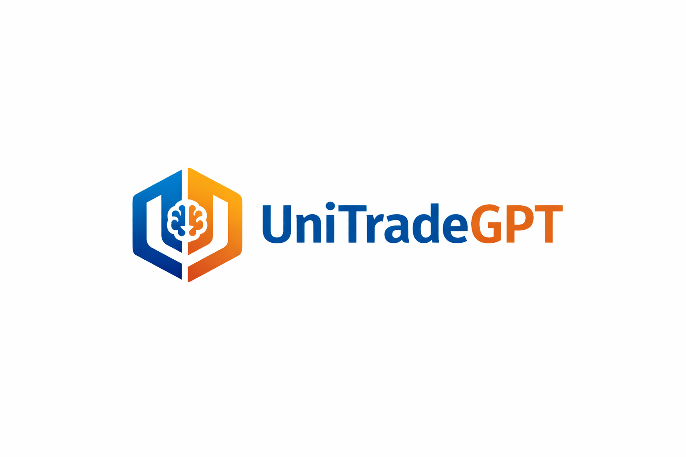

# UniTradeGPT - A secure, student-only marketplace built specifically for college communities. 

This repository contains Alina's, Nich's, and Layla's individual pitches and then milestones for the final idea, UniTradeGPT.

## Milestone 1 - Pitches for an LLM-based app

[Alina's Initial Idea Pitch](Comm4190_F25_Final_Project/Initial Group Member Pitches - Milestone 1/Alina_Idea.ipynb) - UniTradeGPT (LLM-based student marketplace)

[Nicholas's Initial Idea Pitch](nicholas_idea.ipynb) - ThesisCoachGPT (specialized AI mentor for PhD students)

[Layla's Initial Idea Pitch](layla_idea.ipynb) - DocuAssist (document-managing chatbot for researchers)

## Milestone 2 - Summary of UniTradeGPT and Potential Usages

[Final Idea Pitch](Milestone2.ipynb) - Includes the final pitch, target users, data needed, role of the LLM, and the system's novelty

[Usage Scenarios](Usage_Scenarios.ipynb) - Descriptions and narratives of 6 potential usage scenarios including a step-by-step breakdown of the interaction 

## Milestone 3 - Devleoping Prompts For Usage Scenarios 

[Trading Usage Scenario](Milestone3_Trade.ipynb)

[Scheduling Usage Scenario](Milestone3_Schedule.ipynb)

[Interior Design Usage Scenario](Milestone3_InteriorDesign.ipynb)

[Renting and Subletting Usage Scenario](Milestone3_RentingSubletting.ipynb)

[Filtering Usage Scenario](Milestone3_Filter.ipynb)

[Comparison Usage Scenario](Milestone3_Compare.ipynb)

## Milestone 4

In-Class Presentation

## Milestone 5 - Workflow Design and Implementation

[Workflow Code](Milestone4_Workflows.ipynb) - Development of a flow chart to demonstrate the workflow of the LLM-based app

[Workflow Implementation and Testing](Implementation_and_Testing_of_Workflow.ipynb) - Testing the developed workflow 

